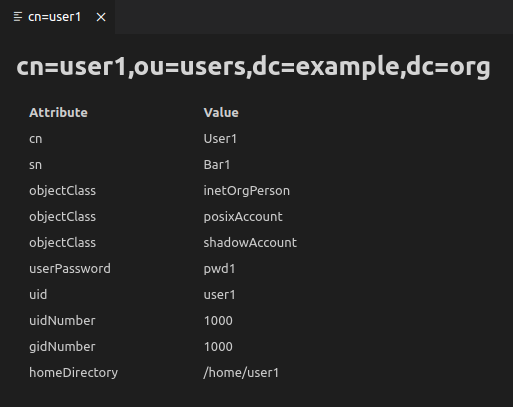
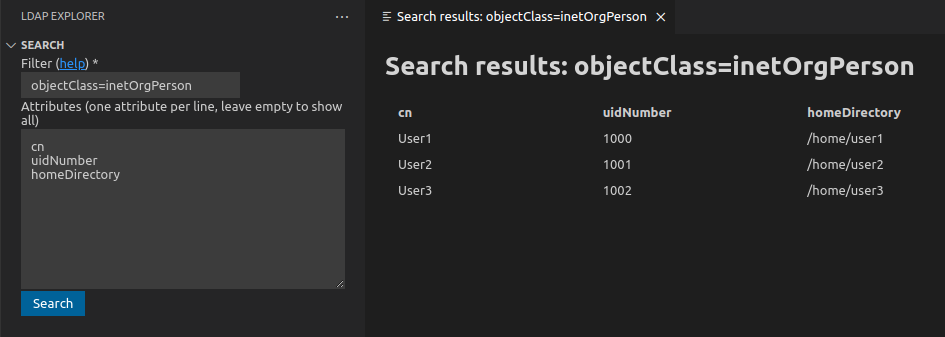
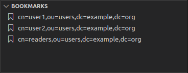
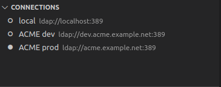

# [LDAP Explorer](https://marketplace.visualstudio.com/items?itemName=fengtan.ldap-explorer)

[](https://github.com/fengtan/ldap-explorer/actions/workflows/build.yml)

[LDAP](https://en.wikipedia.org/wiki/Lightweight_Directory_Access_Protocol) client for [VS Code](https://code.visualstudio.com/).


## Features

### Browse the directory information tree


### List attributes



### Search and filter



### Manage bookmarks



### Support for multiple connections



## Installation

* Open VS Code
* Open the [extension view](https://code.visualstudio.com/docs/editor/extension-marketplace) by hitting `Ctrl+Shift+X` (or `Cmd+Shift+X`) and install [LDAP Explorer](https://marketplace.visualstudio.com/items?itemName=fengtan.ldap-explorer)
* Alternatively, hit `Ctrl+P` (or `Cmd+P`) and type `ext install fengtan.ldap-explorer`

## Commands

This extension contributes the following commands:

* **LDAP Explorer: Add new Connection**
* **LDAP Explorer: Edit Connection**
* **LDAP Explorer: Delete Connection**
* **LDAP Explorer: Set active Connection** - An active connection is required for the Tree, Bookmarks and Search views to be functional
* **LDAP Explorer: Set no active Connection** - Clears currently active connection, if any
* **LDAP Explorer: Refresh** - Refreshes the Connections, Tree and Bookmarks views
* **LDAP Explorer: Show Attributes** - Lists attributes of a given LDAP entry
* **LDAP Explorer: Copy DN to clipboard**
* **LDAP Explorer: Add to Bookmarks** - The LDAP entry will be added to the Bookmarks view
* **LDAP Explorer: Remove from Bookmarks** - The LDAP entry will be removed from the Bookmarks view

## Configuration

This extension contributes the following settings:

* **ldap-explorer.show-tree-item-icons** (`false`)

If set to `true`, LDAP entries in the Tree view will be rendered with an icon based on their entity type:
- `dc`, `c`, `o` or `ou`: 
- `cn`: 
- otherwise: 

| `ldap-explorer.show-tree-item-icons: false` | `ldap-explorer.show-tree-item-icons: true` |
|---------------------------------------------|--------------------------------------------|
| |  |

* **ldap-explorer.connections** (`[]`)

List of LDAP connections. Example:

```json
{
  "ldap-explorer.connections": [
    {
      "name": "ACME prod",
      "protocol": "ldap",
      "host": "acme.example.net",
      "port": "389",
      "binddn": "cn=admin,dc=example,dc=org",
      "bindpwd": "foobar",
      "basedn": "dc=example,dc=org",
      "limit": "0",
      "timeout": "5000",
      "bookmarks": [
        "cn=readers,ou=users,dc=example,dc=org"
      ]
    }
  ]
}
```

## Known limitations

No support for the following as those are not supported by the underlying library:
- [LDIF](https://en.wikipedia.org/wiki/LDAP_Data_Interchange_Format) - see http://ldapjs.org/#whats-not-in-the-box
- [Aliases](https://ldapwiki.com/wiki/Alias) - see http://ldapjs.org/#whats-not-in-the-box

## Alternative tools

* [Apache Directory Studio](https://directory.apache.org/studio/) is a fully-featured LDAP client based on [Eclipse RCP](https://wiki.eclipse.org/Rich_Client_Platform)
- [JXplorer](http://jxplorer.org/) is a cross-platform LDAP browser and editor with many features
- [ldapsearch](https://linux.die.net/man/1/) is a command-line tool for *nix systems
* [dsquery](https://learn.microsoft.com/en-us/previous-versions/windows/it-pro/windows-server-2012-r2-and-2012/cc754232(v=ws.11)) is a command-line tool for Windows
- [LEX](http://www.ldapexplorer.com/) is a Windows-only desktop client that requires a paying license (a free trial is offered)
- [Many others](https://en.wikipedia.org/wiki/List_of_LDAP_software)

## Contributing

See [CONTRIBUTING.md](https://github.com/fengtan/ldap-explorer/blob/master/CONTRIBUTING.md).

## Credits

This extension is powered by [ldapjs](http://ldapjs.org/).

Main icon by [Freepik](https://www.freepik.com/) from [Flaticon](https://www.flaticon.com/) is licensed by [CC 3.0 BY](https://creativecommons.org/licenses/by/3.0/).
