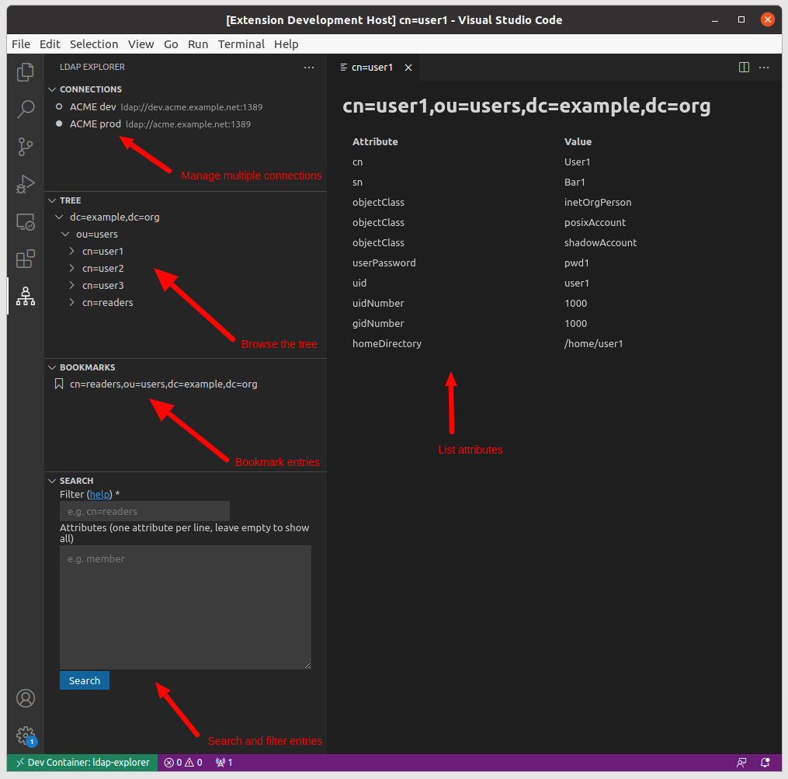
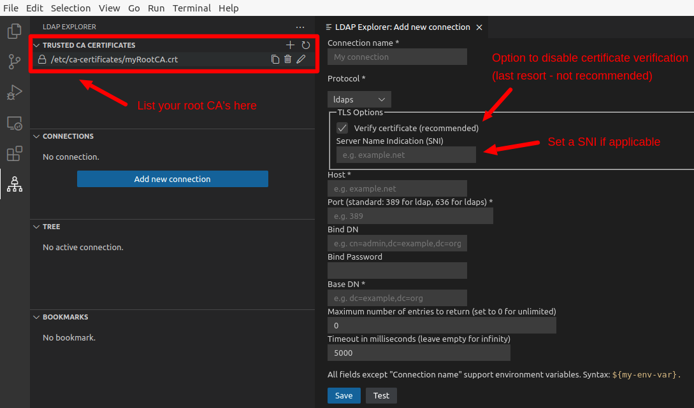
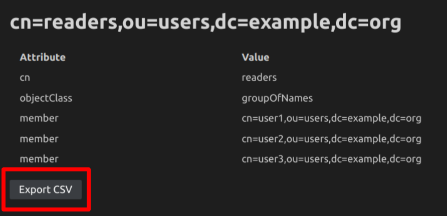
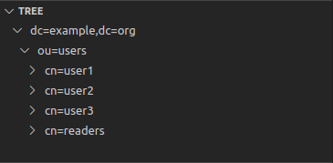
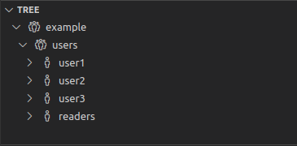

# [LDAP Explorer](https://marketplace.visualstudio.com/items?itemName=fengtan.ldap-explorer)

[](https://github.com/fengtan/ldap-explorer/actions/workflows/build.yml)

[LDAP](https://en.wikipedia.org/wiki/Lightweight_Directory_Access_Protocol) client for [VS Code](https://code.visualstudio.com/).



## Features

* **Browse the tree** - Explore how the [DIT](https://en.wikipedia.org/wiki/Directory_information_tree) is structured and discover LDAP entries in an intuitive interface
* **List attributes** - Find out about LDAP attributes without writing search filters
* **Search and filter** - Conveniently search for LDAP entries directly from VS Code
* **Export LDAP entries as CSV** - Share and analyze LDAP results using a standard CSV format
* **Manage bookmarks** - Bookmark LDAP entries you often need to check or located in awkward places
* **Support for multiple connections** - Manage multiple LDAP connections, such as a test and a production connections
* **Support for environment variables** - Easy integration with containers and increased security: you don't have to store your bind credentials unencrypted in VS Code settings

## Demo

See [this animation](screenshots/anim.gif) for a demo.

## Installation

* Open VS Code
* Open the [extension view](https://code.visualstudio.com/docs/editor/extension-marketplace) by hitting `Ctrl+Shift+X` (or `Cmd+Shift+X`) and install [LDAP Explorer](https://marketplace.visualstudio.com/items?itemName=fengtan.ldap-explorer)
* Alternatively, hit `Ctrl+P` (or `Cmd+P`) and type `ext install fengtan.ldap-explorer`

## Usage

### Connecting to an LDAP server

1. Open the **LDAP Explorer** view from the [activity bar](https://code.visualstudio.com/docs/getstarted/userinterface)
2. Under panel **Connections**, click the button **Add new connection**
3. Fill in the connection settings (leave **Bind DN** and **Bind Password** empty to bind as anonymous)
4. Under panel **Connections**, click on the connection to activate it
5. Now you may browse the tree, manage bookmarks and run search queries from the **Tree**, **Bookmarks** and **Search** panels, respectively

### TLS

A fieldset **TLS options** shows up if:
- The connection's protocol is set to **ldaps** ; or
- The connection's protocol is set to **ldap** and the checkbox **StartTLS** is checked

If your server's certificate is self-signed then you may want to list your root Certificate Authority in the view **Trusted CA Certificates**.

If your server is multi-homed then you may want to set the connection's **Server Name Indication (SNI)** field to the host being connected to (it should be a host name, not an IP address). Leave this field empty if the certificate matches the host name. The [opensslutils](https://marketplace.visualstudio.com/items?itemName=ffaraone.opensslutils) extension comes with a handy command to inspect the contents of a certificate, for instance if you need to confirm that the certificate's Common Name (CN) matches the host name.

As a last resort uncheck **Verify certificate** to skip any certificate verification (not recommended).



### CSV export

When listing LDAP entries, a button labeled **Export CSV** is provided at the bottom of the page and allows to export the contents as CSV:



## Commands

This extension contributes the following commands:

* **LDAP Explorer: Add new Connection**
* **LDAP Explorer: Edit Connection**
* **LDAP Explorer: Delete Connection**
* **LDAP Explorer: Set active Connection** - An active connection is required for the Tree, Bookmarks and Search views to be functional
* **LDAP Explorer: Set no active Connection** - Clears currently active connection, if any
* **LDAP Explorer: Refresh** - Refreshes the Trusted CA Certificates, Connections, Tree and Bookmarks views
* **LDAP Explorer: Show Attributes** - Lists attributes of a given LDAP entry
* **LDAP Explorer: Reveal in Tree** - Shows a given LDAP entry in the Tree view
* **LDAP Explorer: Add to Bookmarks** - The LDAP entry will be added to the Bookmarks view
* **LDAP Explorer: Remove from Bookmarks** - The LDAP entry will be removed from the Bookmarks view
* **LDAP Explorer: Add new CA certificate**
* **LDAP Explorer: Edit CA certificate**
* **LDAP Explorer: Delete CA certificate**

## Configuration

This extension contributes the following settings:

* **ldap-explorer.binary-attributes** (`["caCertificate", "jpegPhoto", "krbExtraData", "msExchArchiveGUID", "msExchBlockedSendersHash", "msExchMailboxGuid", "msExchSafeSendersHash", "networkAddress", "objectGUID", "objectSid", "userCertificate", "userSMIMECertificate"]`)

Name of binary attributes (case insentitive). They will be represented as Base64 strings.

* **ldap-explorer.binary-decode** (`true`)

If `true` then the `objectGUID` binary attribute will be decoded and represented as a UUID (regardless of whether `objectGUID` is listed in `ldap-explorer.binary-attributes`).

* **ldap-explorer.cacerts** (`[]`)

List of trusted root certificates. Example:

```json
{
  "ldap-explorer.cacerts": [
    "/etc/ca-certificates/myRootCA.crt"
  ]
}
```

* **ldap-explorer.connections** (`[]`)

List of LDAP connections. Example:

```json
{
  "ldap-explorer.connections": [
    {
      "name": "ACME prod",
      "protocol": "ldap",
      "starttls": "false",
      "verifycert": "true",
      "sni": "",
      "host": "acme.example.net",
      "port": "389",
      "binddn": "cn=admin,dc=example,dc=org",
      "bindpwd": "foobar",
      "basedn": "dc=example,dc=org",
      "limit": "0",
      "paged": "true",
      "timeout": "5000",
      "bookmarks": [
        "cn=readers,ou=users,dc=example,dc=org"
      ]
    }
  ]
}
```

* **ldap-explorer.show-tree-item-icons** (`false`)

If set to `true`, LDAP entries in the Tree view will be rendered with an icon based on their entity type:
- `dc`, `c`, `o` or `ou`: [organization icon](https://raw.githubusercontent.com/microsoft/vscode-codicons/main/src/icons/organization.svg)
- `cn`: [person icon](https://raw.githubusercontent.com/microsoft/vscode-codicons/main/src/icons/person.svg)
- otherwise: [primitive square icon](https://raw.githubusercontent.com/microsoft/vscode-codicons/main/src/icons/primitive-square.svg)

| `ldap-explorer.show-tree-item-icons: false` | `ldap-explorer.show-tree-item-icons: true` |
|---------------------------------------------|--------------------------------------------|
| |  |

## Known limitations

No support for
- [LDAP aliases](https://ldapwiki.com/wiki/Alias) - [not supported by ldapjs](http://ldapjs.org/#whats-not-in-the-box)
- [SASL](https://en.wikipedia.org/wiki/Simple_Authentication_and_Security_Layer) / [GSSAPI](https://en.wikipedia.org/wiki/Generic_Security_Services_Application_Program_Interface) binding - [not supported by ldapjs](https://github.com/ldapjs/node-ldapjs/issues/85)


## Recommended extensions

* [LDIF syntax](https://marketplace.visualstudio.com/items?itemName=jtavin.ldif) if you work with [LDIF](https://en.wikipedia.org/wiki/LDAP_Data_Interchange_Format) files
* [opensslutils](https://marketplace.visualstudio.com/items?itemName=ffaraone.opensslutils) if you need to troubleshoot TLS connections (LDAPS or StartTLS)

## Alternative tools

* [Apache Directory Studio](https://directory.apache.org/studio/) is a fully-featured LDAP client based on [Eclipse RCP](https://wiki.eclipse.org/Rich_Client_Platform)
- [JXplorer](http://jxplorer.org/) is a cross-platform LDAP browser and editor with many features
- [ldapsearch](https://linux.die.net/man/1/) is a command-line tool for *nix systems
* [dsquery](https://learn.microsoft.com/en-us/previous-versions/windows/it-pro/windows-server-2012-r2-and-2012/cc754232(v=ws.11)) is a command-line tool for Windows
- [LEX](http://www.ldapexplorer.com/) is a Windows-only desktop client that requires a paying license (a free trial is offered)
- [Many others](https://en.wikipedia.org/wiki/List_of_LDAP_software)

## Contributing

See [CONTRIBUTING.md](https://github.com/fengtan/ldap-explorer/blob/master/CONTRIBUTING.md).

## Changelog

See [CHANGELOG.md](https://github.com/fengtan/ldap-explorer/blob/master/CHANGELOG.md).

## Credits

This extension is powered by [ldapjs](http://ldapjs.org/).

[Main icon](https://www.flaticon.com/free-icon/hierarchy_4987367) by [Freepik](https://www.freepik.com/) from [Flaticon](https://www.flaticon.com/) is licensed by [CC 3.0 BY](https://creativecommons.org/licenses/by/3.0/).
