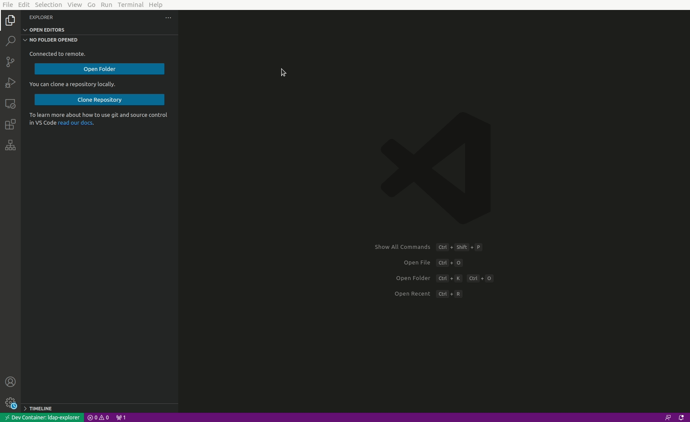

# [LDAP Explorer](https://marketplace.visualstudio.com/items?itemName=fengtan.ldap-explorer)

[](https://github.com/fengtan/ldap-explorer/actions/workflows/build.yml)

[LDAP](https://en.wikipedia.org/wiki/Lightweight_Directory_Access_Protocol) client for [VS Code](https://code.visualstudio.com/). Browse the tree, list attributes, search, filter, bookmark LDAP entries.



## Features

### Browse the tree

Explore how the [DIT](https://en.wikipedia.org/wiki/Directory_information_tree) is structured and discover LDAP entries in an intuitive, hierarchical way.


### List attributes

Find out about LDAP attributes, even if you don't know how to write LDAP search filters.


### Search and filter

Quickly search for LDAP entries directly from the VS Code interface. [How do I write an LDAP search filter ?](https://ldap.com/ldap-filters/)


### Manage bookmarks

Bookmark LDAP entries you often check, or located in places you may forget.


### Support for multiple connections

Manage multiple LDAP connections, such as a test and a production environment.


### Support for environment variables

Connection settings can be set with environment variables (you may not want to store your bind credentials unencrypted).

This also means that this extension plays nicely with containers and [remote environments](https://code.visualstudio.com/docs/remote/remote-overview).


## Installation

* Open VS Code
* Open the [extension view](https://code.visualstudio.com/docs/editor/extension-marketplace) by hitting `Ctrl+Shift+X` (or `Cmd+Shift+X`) and install [LDAP Explorer](https://marketplace.visualstudio.com/items?itemName=fengtan.ldap-explorer)
* Alternatively, hit `Ctrl+P` (or `Cmd+P`) and type `ext install fengtan.ldap-explorer`

## Usage

* Open the **LDAP Explorer** view from the [activity bar](https://code.visualstudio.com/docs/getstarted/userinterface)
* Under **Connections**, click the button **Add new connection**
* Fill in the connection settings
  * As stated most of the settings support environment variables
  * Leave **Bind DN** and **Bind Password** empty to bind as anonymous
  * **Maximum number of entries to return** allows to limit the size of LDAP responses, although most LDAP servers will return at most 1,000 entries regardless of this setting. If an LDAP query returns more than this limit then you will be shown an error (in which case you may try to increase the limit).
* Click on the connection to activate it
* Now you may browse the tree, create bookmarks and run search queries from the **Tree**, **Bookmarks** and **Search** views, respectively

## Commands

This extension contributes the following commands:

* **LDAP Explorer: Add new Connection**
* **LDAP Explorer: Edit Connection**
* **LDAP Explorer: Delete Connection**
* **LDAP Explorer: Set active Connection** - An active connection is required for the Tree, Bookmarks and Search views to be functional
* **LDAP Explorer: Set no active Connection** - Clears currently active connection, if any
* **LDAP Explorer: Refresh** - Refreshes the Connections, Tree and Bookmarks views
* **LDAP Explorer: Show Attributes** - Lists attributes of a given LDAP entry
* **LDAP Explorer: Copy DN to clipboard**
* **LDAP Explorer: Add to Bookmarks** - The LDAP entry will be added to the Bookmarks view
* **LDAP Explorer: Remove from Bookmarks** - The LDAP entry will be removed from the Bookmarks view

## Configuration

This extension contributes the following settings:

* **ldap-explorer.show-tree-item-icons** (`false`)

If set to `true`, LDAP entries in the Tree view will be rendered with an icon based on their entity type:
- `dc`, `c`, `o` or `ou`: 
- `cn`: 
- otherwise: 

| `ldap-explorer.show-tree-item-icons: false` | `ldap-explorer.show-tree-item-icons: true` |
|---------------------------------------------|--------------------------------------------|
| |  |

* **ldap-explorer.connections** (`[]`)

List of LDAP connections. Example:

```json
{
  "ldap-explorer.connections": [
    {
      "name": "ACME prod",
      "protocol": "ldap",
      "host": "acme.example.net",
      "port": "389",
      "binddn": "cn=admin,dc=example,dc=org",
      "bindpwd": "foobar",
      "basedn": "dc=example,dc=org",
      "limit": "0",
      "timeout": "5000",
      "bookmarks": [
        "cn=readers,ou=users,dc=example,dc=org"
      ]
    }
  ]
}
```

## Known limitations

No support for
- [LDIF](https://en.wikipedia.org/wiki/LDAP_Data_Interchange_Format) - [not supported by ldapjs](http://ldapjs.org/#whats-not-in-the-box)
- [LDAP aliases](https://ldapwiki.com/wiki/Alias) - [not supported by ldapjs](http://ldapjs.org/#whats-not-in-the-box)
- [SASL](https://en.wikipedia.org/wiki/Simple_Authentication_and_Security_Layer) / [GSSAPI](https://en.wikipedia.org/wiki/Generic_Security_Services_Application_Program_Interface) binding - [not supported by ldapjs](https://github.com/ldapjs/node-ldapjs/issues/85)

## Alternative tools

* [Apache Directory Studio](https://directory.apache.org/studio/) is a fully-featured LDAP client based on [Eclipse RCP](https://wiki.eclipse.org/Rich_Client_Platform)
- [JXplorer](http://jxplorer.org/) is a cross-platform LDAP browser and editor with many features
- [ldapsearch](https://linux.die.net/man/1/) is a command-line tool for *nix systems
* [dsquery](https://learn.microsoft.com/en-us/previous-versions/windows/it-pro/windows-server-2012-r2-and-2012/cc754232(v=ws.11)) is a command-line tool for Windows
- [LEX](http://www.ldapexplorer.com/) is a Windows-only desktop client that requires a paying license (a free trial is offered)
- [Many others](https://en.wikipedia.org/wiki/List_of_LDAP_software)

## Contributing

See [CONTRIBUTING.md](https://github.com/fengtan/ldap-explorer/blob/master/CONTRIBUTING.md).

## Changelog

See [CHANGELOG.md](https://github.com/fengtan/ldap-explorer/blob/master/CHANGELOG.md).

## Credits

This extension is powered by [ldapjs](http://ldapjs.org/).

Main icon by [Freepik](https://www.freepik.com/) from [Flaticon](https://www.flaticon.com/) is licensed by [CC 3.0 BY](https://creativecommons.org/licenses/by/3.0/).
